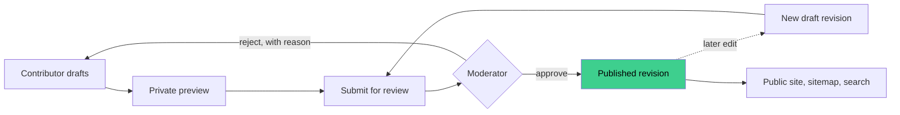

<p align="center">
  
</p>

<h1 align="center">Kakinotes</h1>

<p align="center">
  Real, written, first-person stories from people who did a Working Holiday in New Zealand.<br>
  No feed. No likes. No "top 10 tips". Just what actually happened, from someone who was there.
</p>

<p align="center">
  <a href="https://kakinotes.vercel.app"><strong>kakinotes.vercel.app</strong></a>
</p>

<p align="center">
  <a href="https://github.com/fr4d96/KakiNotes/actions/workflows/ci.yml"></a>
  <a href="https://github.com/fr4d96/KakiNotes/releases"></a>
  
  
  
</p>

---

## Why "Kaki"?

In Malay, _kaki_ is your leg — the thing you walk on. In everyday slang it's also your **buddy**:
the person you do a thing with. A _kaki bola_ plays football with you. A _kaki jalan_ is who you
wander with.

So: **Kakinotes** — notes from the kaki who walked it before you.

The first stories come from Malaysian travellers, but nationality, destination and work type are
just data in a database. Nothing about "Malaysia" or "New Zealand" is hard-coded anywhere.

## What it is (and, more importantly, isn't)

Kakinotes is a **stories-first** platform. Every story is a structured, searchable, human-reviewed
written account with photos — the kind of thing you'd want to read before spending a year of your
life on the other side of the planet.

Every public story carries the same label: **personal experience, not advice.** It's someone's
year. It is not your visa lawyer.

Deliberately **not** on the roadmap:

| We don't do                     | Because                                                              |
| ------------------------------- | -------------------------------------------------------------------- |
| Comments, likes, follows        | The moment there's a leaderboard, people write for the leaderboard.  |
| Live job listings               | They'd be stale in a week; the stories about the jobs won't be.      |
| Budget calculators              | Contributors report what they spent. You do the maths for your life. |
| Visa / legal / tax advice       | See "not your visa lawyer".                                          |
| Audio, video, maps, native apps | Words first. Everything else is a distraction until words work.      |

## What's built

- **Structured story editor** — headings, lists, quotes, links, images. Stored as a controlled
  JSON schema of blocks, never raw HTML, so nothing sketchy ever renders.
- **Image pipeline** — uploads land in a private bucket; only after approval are processed
  derivatives published, with EXIF and GPS stripped. Your photo's location metadata is not part of
  the story.
- **Import from PDF** — editors can attach a contributor's existing write-up and its pages become
  editable blocks. Written stories already existed before the site did; they had to come along.
- **Drafts and revisions that can't leak** — an unapproved edit never replaces what the public
  sees. Draft, private, rejected and archived content stays out of public queries, sitemaps and
  URL-guessing.
- **Two staff workflows, kept apart** — _editorial_ (import, attribution cleanup) and _moderation_
  (approve / reject, with reasons and side-by-side revision diffs) are different roles with
  different tables. Row Level Security is the source of truth; app code re-checks, never
  substitutes.
- **Browse and search** — by region, destination, work type, trip year, tags, reported cost band,
  or plain text. A dedicated [/costs](https://kakinotes.vercel.app/costs) view for what a year
  actually cost people.
- **Contributor profiles** — display name of the contributor's choosing; only fields explicitly
  marked public are ever public.
- **Reader reports** — flag a story, staff triage it with private notes.
- **Two languages** — English (en-NZ dates and numbers) and Simplified Chinese, switched by a
  cookie, no URL gymnastics. Region, destination and category names are translated data, not
  translated strings.
- **Consent and image rights are recorded, not assumed.**

## How a story travels



The public site only ever reads the **approved, published revision**. A rejected edit goes back
to the contributor with a reason; the live story is untouched.

## Stack

| Layer      | Choice                                                                             |
| ---------- | ---------------------------------------------------------------------------------- |
| Framework  | [Next.js](https://nextjs.org) 16 (App Router, Server Components) · React 19        |
| Data       | [Supabase](https://supabase.com) — Postgres with Row Level Security, Auth, Storage |
| Styling    | Tailwind CSS 4                                                                     |
| i18n       | next-intl                                                                          |
| Images     | sharp                                                                              |
| PDF        | pdfjs-dist (read) · pdfkit (export)                                                |
| Validation | Zod at every trust boundary                                                        |
| Tests      | Vitest + React Testing Library · Playwright                                        |
| Hosting    | Vercel (production from the `release` branch)                                      |

## By the numbers

|                                                      |                                                                                                  |
| ---------------------------------------------------- | ------------------------------------------------------------------------------------------------ |
| First commit                                         | 2 August 2026                                                                                    |
| Unit tests                                           | 1,098 across 92 files                                                                            |
| Browser (e2e) specs                                  | 62 across 13 files                                                                               |
| Database migrations                                  | 119                                                                                              |
| Lines of UI copy per language                        | 1,118                                                                                            |
| Times the word "index" has been used as a route name | 1 — and never again ([it collides with `/`](https://github.com/fr4d96/KakiNotes/commit/aacd591)) |

## Getting started

You need **Node 24** (there's an `.nvmrc`) and a Supabase project for development.

```bash
cp .env.example .env.local   # fill in your Supabase DEVELOPMENT project's values
npm install
npm run dev
```

Open [http://localhost:3000](http://localhost:3000).

`.env.example` lists the four variables. Three are public and browser-safe. The fourth,
`SUPABASE_SERVICE_ROLE_KEY`, is server-only and used by exactly one thing (the image pipeline). It
never goes near the browser, a client component, or CI.

### The one command that matters

```bash
npm run verify
```

Format check → lint → typecheck → unit tests → production build. It's the same gate locally and in
CI; if it's green, the change is done. `npm run verify:full` adds the Playwright suite.

<details>
<summary>All scripts</summary>

| Script                                        | What it does                                       |
| --------------------------------------------- | -------------------------------------------------- |
| `npm run dev`                                 | Local dev server                                   |
| `npm run build` / `npm run start`             | Production build / serve it                        |
| `npm run lint` / `npm run typecheck`          | ESLint / `tsc --noEmit`                            |
| `npm run format` / `npm run format:check`     | Prettier                                           |
| `npm run test`                                | Vitest + React Testing Library                     |
| `npm run test:e2e`                            | Build, then Playwright                             |
| `npm run verify` / `npm run verify:full`      | The gate / the gate plus Playwright                |
| `npm run supabase:start` / `:stop` / `:reset` | Local Supabase stack (needs Docker)                |
| `npm run supabase:types` / `:types:linked`    | Regenerate `types/database.ts` from local / hosted |

</details>

## Shipping

```
feature branch ──► main ──► release ──► Vercel
                    │          │
                 CI runs    CI runs, then release-please bumps the version,
                            writes CHANGELOG.md, tags vX.Y.Z and publishes
                            a GitHub Release — no PR to click.
```

Commits follow [Conventional Commits](https://www.conventionalcommits.org): `feat:` bumps the
minor version, `fix:` bumps the patch, and the commit message becomes the changelog line. Write
it like someone will read it — someone will.

## Project layout

```
app/            routes — (public) · (contributor) · (editor) · (moderation) · (auth)
components/     UI, Server Components by default
lib/            Supabase clients, validation, story model, image + PDF pipelines
i18n/           locales, next-intl config, messages/{en,zh-CN}.json
supabase/       migrations (schema, RLS, storage policies) · seed.sql (fictional only)
tests/          Vitest configs · integration (RLS, against a real project) · e2e (Playwright)
docs/           product spec · architecture · content governance · implementation status
```

## House rules

The full list lives in [CLAUDE.md](CLAUDE.md) — 22 engineering rules that every change is held to.
The spirit of them:

1. **Never trust the client.** IDs, roles, ownership, publication state — re-derived on the server,
   every mutation, every time.
2. **RLS is the law.** Application checks are a second lock, never a replacement. Weakening a policy
   to "fix" a bug is not a fix.
3. **Drafts don't leak.** Not through queries, sitemaps, metadata, previews, or image URLs.
4. **Some data is never collected.** Passport scans, visa documents, bank details, live location,
   medical records — not in the schema, not in seed data, not ever.
5. **Seed data is fiction.** Real contributor content is imported by editors, not committed to git.
6. **Mobile first, keyboard always.** Verify at 375px before you admire it on a monitor.

## Docs

|                                                                            |                                                                     |
| -------------------------------------------------------------------------- | ------------------------------------------------------------------- |
| [docs/product-spec.md](docs/product-spec.md)                               | What Kakinotes is, who it's for, what it refuses to be              |
| [docs/architecture.md](docs/architecture.md)                               | Every layer, the auth model, the database, CI and releases          |
| [docs/content-governance.md](docs/content-governance.md)                   | Consent, moderation, attribution — the human rules                  |
| [docs/implementation-status.md](docs/implementation-status.md)             | The running log of what was built, what broke, and what was learned |
| [docs/implementation-status-human.md](docs/implementation-status-human.md) | The same log, in plain language, for humans in a hurry              |
| [CHANGELOG.md](CHANGELOG.md)                                               | Generated per release                                               |
| [CLAUDE.md](CLAUDE.md)                                                     | Orientation for any engineer, human or otherwise                    |

---

<p align="center">
  <sub>Personal experience, not advice. Every story on Kakinotes is one person's year — read it that way.</sub>
</p>
